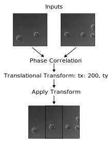

# image-register-rs

This rust library provides capabilities for image registration via phase correlation.



## API

```
```

## testing

1. From the example image, creates cropped and offset images at test_images/translated.
2. Runs registration and merging and outputs the registered metrics and merged image to test_images/registered.
```
cargo test
```

# TODO
add hamming window option for edge artifacts
add sub pixel registration option
